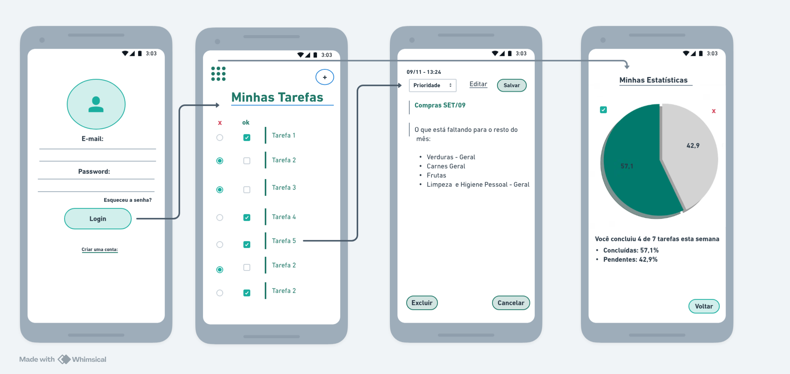

# Prot-tipo-do-app-Minhas-Tarefas

O *Minhas Tarefas* é um aplicativo web desenvolvido para ajudar na organização e controle de atividades do dia a dia.   Com uma interface simples e intuitiva, o projeto permite adicionar, editar, concluir e excluir tarefas, além de acompanhar estatísticas em tempo real através de um gráfico visual e dinâmico.

## Descrição do Projeto

O *Minhas Tarefas* é um aplicativo web desenvolvido para ajudar na organização e controle de atividades do dia a dia.  
Com uma interface simples e intuitiva, o projeto permite adicionar, editar, concluir e excluir tarefas, além de acompanhar estatísticas em tempo real através de um gráfico visual e dinâmico.
O foco principal do projeto é oferecer uma experiência prática e direta, facilitando o gerenciamento pessoal de tarefas de forma leve e eficiente.

## Wireframe

## Funcionalidades Principais
- Adicionar novas tarefas  
- Editar e detalhar tarefas existentes  
- Marcar tarefas como concluídas  
- Excluir tarefas  
- Visualizar estatísticas de tarefas concluídas e pendentes  
- Alternar entre modo claro e escuro  

 ## Tecnologias Utilizadas
- HTML5 → estrutura e organização do conteúdo  
- CSS3 → estilização e responsividade da interface  
- JavaScript (puro) → lógica principal e interatividade  
- Chart.js → exibição de gráfico de pizza para estatísticas  

## Como executar o projeto

> Baixar o projeto e abrir o arquivo index.html
